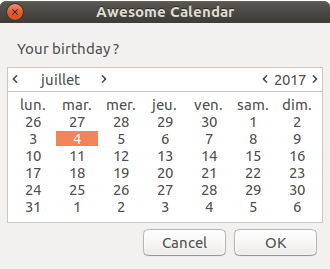

.. image:: https://badge.fury.io/py/zenipy.png
    :target: http://badge.fury.io/py/zenipy

.. image:: https://readthedocs.org/projects/zenipy/badge/?version=latest
    :target: http://zenipy.readthedocs.io/en/latest/?badge=latest
    :alt: Documentation Status

Zenipy
******

Zenipy is a library for python which was inspired by Zenity. When you write scripts,
you can use Zenipy to create simple dialogs that interact graphically with the user.

Requirements
============

* Python 2 or 3
* GTK+3
* python3-gi or python-gi (for python2)

Installation
============

Install using pip :

.. code-block:: bash

    $ pip install zenipy

Or clone the repo :

.. code-block:: bash

    $ git clone https://github.com/poulp/zenipy.git
    $ cd ./zenipy
    $ python setup.py install

Example
=======

Simple dialog :

.. code-block:: python

    from zenipy import calendar
    result = calendar(title="Awesome Calendar",text="Your birthday ?")
    print(result)

This code show a calendar dialog :
    

And display the result :

.. code-block:: bash

    $ python test.py
    $ (year=2017, month=6, day=4)

API
===

.. code-block:: python

    zenipy.zenipy.message(title='', text='', width=330, height=120, timeout=None)

Display a simple message

   Parameters:
      * **text** (*str*) – text inside the window

      * **title** (*str*) – title of the window

      * **width** (*int*) – window width

      * **height** (*int*) – window height

      * **timeout** (*int*) – close the window after n seconds

.. code-block:: python
    
    zenipy.zenipy.error(title='', text='', width=330, height=120, timeout=None)

Display a simple error

   Parameters:
      * **text** (*str*) – text inside the window

      * **title** (*str*) – title of the window

      * **width** (*int*) – window width

      * **height** (*int*) – window height

      * **timeout** (*int*) – close the window after n seconds

.. code-block:: python
    
    zenipy.zenipy.warning(title='', text='', width=330, height=120, timeout=None)

Display a simple warning

   Parameters:
      * **text** (*str*) – text inside the window

      * **title** (*str*) – title of the window

      * **width** (*int*) – window width

      * **height** (*int*) – window height

      * **timeout** (*int*) – close the window after n seconds

.. code-block:: python
    
    zenipy.zenipy.question(title='', text='', width=330, height=120, timeout=None)

Display a question, possible answer are yes/no.

   Parameters:
      * **text** (*str*) – text inside the window

      * **title** (*str*) – title of the window

      * **width** (*int*) – window width

      * **height** (*int*) – window height

      * **timeout** (*int*) – close the window after n seconds

   Returns:
      The answer as a boolean

   Return type:
      bool

.. code-block:: python
    
    zenipy.zenipy.entry(text='', placeholder='', title='', width=330, height=120, timeout=None)

Display a text input

   Parameters:
      * **text** (*str*) – text inside the window

      * **placeholder** (*str*) – placeholder for the input

      * **title** (*str*) – title of the window

      * **width** (*int*) – window width

      * **height** (*int*) – window height

      * **timeout** (*int*) – close the window after n seconds

   Returns:
      The content of the text input

   Return type:
      str

.. code-block:: python
    
    zenipy.zenipy.password(text='', placeholder='', title='', width=330, height=120, timeout=None)

Display a text input with hidden characters

   Parameters:
      * **text** (*str*) – text inside the window

      * **placeholder** (*str*) – placeholder for the input

      * **title** (*str*) – title of the window

      * **width** (*int*) – window width

      * **height** (*int*) – window height

      * **timeout** (*int*) – close the window after n seconds

   Returns:
      The content of the text input

   Return type:
      str

.. code-block:: python
    
    zenipy.zenipy.zlist(columns, items, print_columns=None, text='', title='', width=330, height=120, timeout=None)

Display a list of values

   Parameters:
      * **columns** (*list of strings*) – a list of columns name

      * **items** (*list of strings*) – a list of values

      * **print_columns** (*int** (**None if all the columns**)*) –
        index of a column (return just the values from this column)

      * **text** (*str*) – text inside the window

      * **title** (*str*) – title of the window

      * **width** (*int*) – window width

      * **height** (*int*) – window height

      * **timeout** (*int*) – close the window after n seconds

   Returns:
      A row of values from the table

   Return type:
      list

.. code-block:: python
    
    zenipy.zenipy.file_selection(multiple=False, directory=False, save=False, confirm_overwrite=False, filename=None, title='', width=330, height=120, timeout=None)

Open a file selection window

   Parameters:
      * **multiple** (*bool*) – allow multiple file selection

      * **directory** (*bool*) – only directory selection

      * **save** (*bool*) – save mode

      * **confirm_overwrite** (*bool*) – confirm when a file is
        overwritten

      * **filename** (*str*) – placeholder for the filename

      * **text** (*str*) – text inside the window

      * **title** (*str*) – title of the window

      * **width** (*int*) – window width

      * **height** (*int*) – window height

      * **timeout** (*int*) – close the window after n seconds

   Returns:
      path of files selected.

   Return type:
      string or list if multiple enabled

.. code-block:: python
    
    zenipy.zenipy.calendar(text='', day=None, month=None, title='', width=330, height=120, timeout=None)

Display a calendar

   Parameters:
      * **text** (*str*) – text inside the window

      * **day** (*int*) – default day

      * **month** (*int*) – default month

      * **text** – text inside the window

      * **title** (*str*) – title of the window

      * **width** (*int*) – window width

      * **height** (*int*) – window height

      * **timeout** (*int*) – close the window after n seconds

   Returns:
      (year, month, day)

   Return type:
      tuple

.. code-block:: python
    
    zenipy.zenipy.color_selection(show_palette=False, opacity_control=False, title='', width=330, height=120, timeout=None)

Display a color selection dialog

   Parameters:
      * **show_palette** (*bool*) – hide/show the palette with
        preselected colors

      * **opacity_control** (*bool*) – allow to control opacity

      * **title** (*str*) – title of the window

      * **width** (*int*) – window width

      * **height** (*int*) – window height

      * **timeout** (*int*) – close the window after n seconds

   Returns:
      the color selected by the user

   Return type:
      str

.. code-block:: python
    
    zenipy.zenipy.scale(text='', value=0, min=0, max=100, step=1, draw_value=True, title='', width=330, height=120, timeout=None)

Select a number with a range widget

   Parameters:
      * **text** (*str*) – text inside window

      * **value** (*int*) – current value

      * **min** (*int*) – minimum value

      * **max** (*int*) – maximum value

      * **step** (*int*) – incrementation value

      * **draw_value** (*bool*) – hide/show cursor value

      * **title** (*str*) – title of the window

      * **width** (*int*) – window width

      * **height** (*int*) – window height

      * **timeout** (*int*) – close the window after n seconds

   Returns:
      The value selected by the user

   Return type:
      float
